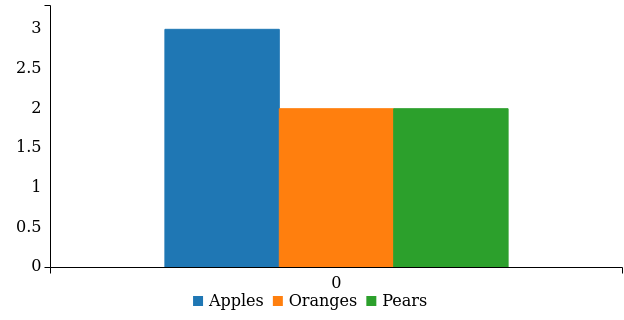
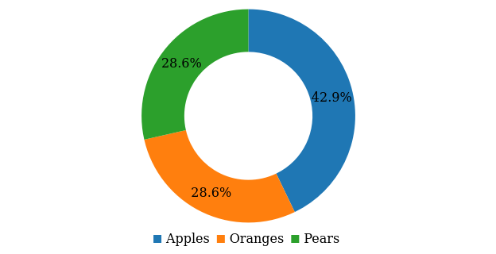
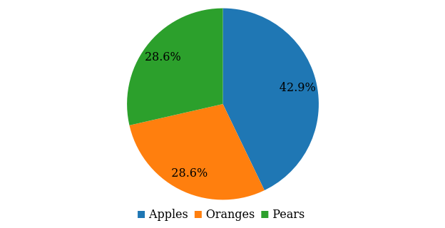
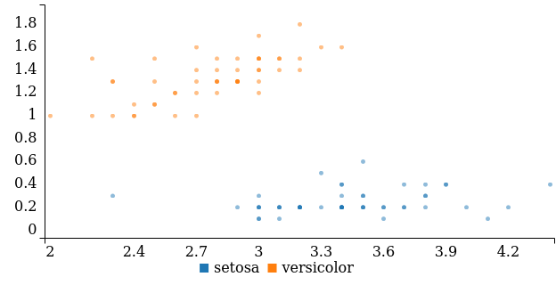
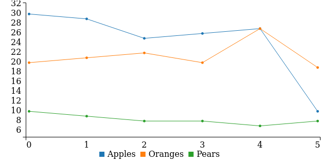
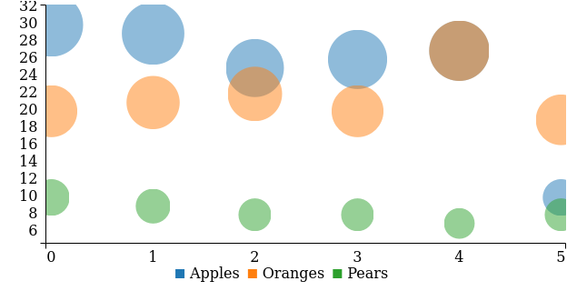
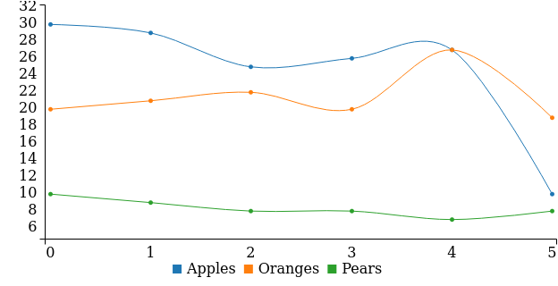
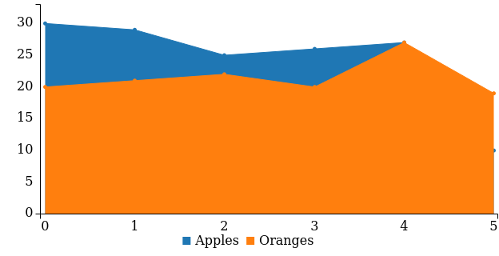
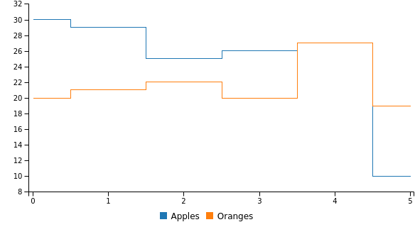

## Charts
### bar chart

[Source](examples/bar_chart.yml)

### donut chart

[Source](examples/donut_chart.yml)

### pie chart

[Source](examples/pie_chart.yml)

### gauge chart

[Source](examples/gauge_chart.yml)

### scatter chart

[Source](examples/scatter_chart.yml)

### line chart

[Source](examples/line_chart.yml)

### bubble chart

[Source](examples/bubble_chart.yml)

### spline chart

[Source](examples/spline_chart.yml)

### area chart

[Source](examples/area_chart.yml)

### step chart

[Source](examples/step_chart.yml)

## Controls
### dropdown

[Source](examples/dropdown.yml)

## Text
### h1 text

[Source](examples/h1_text.yml)

### h2 text

[Source](examples/h2_text.yml)

### h3 text

[Source](examples/h3_text.yml)

### p text

[Source](examples/p_text.yml)

