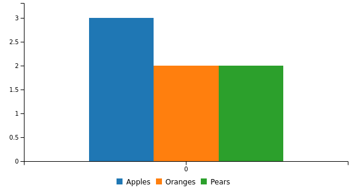
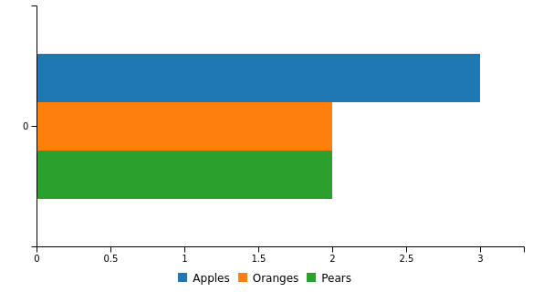
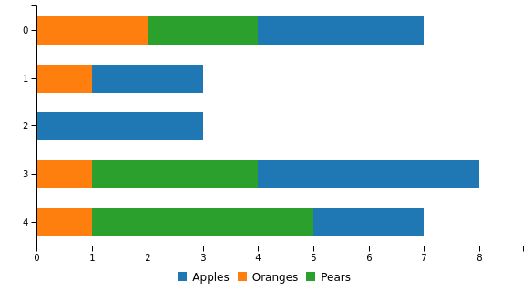
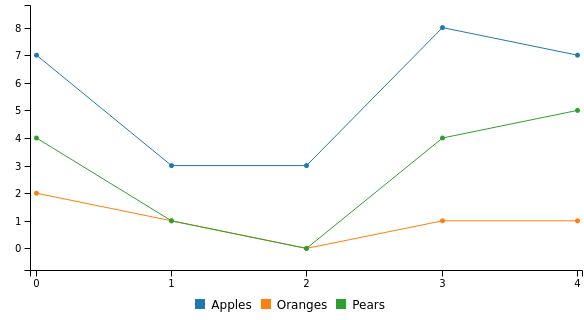
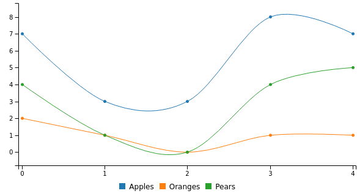
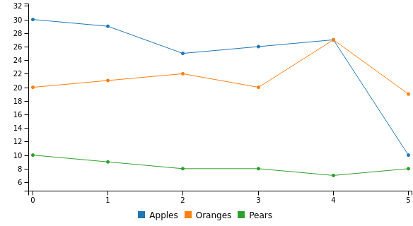
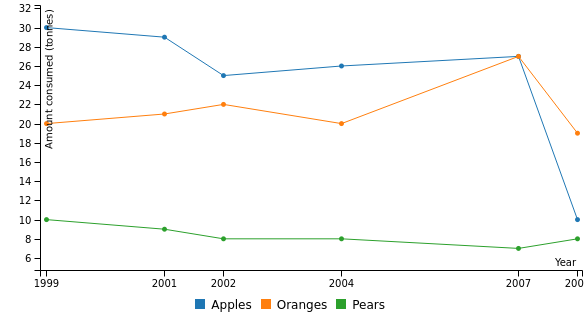
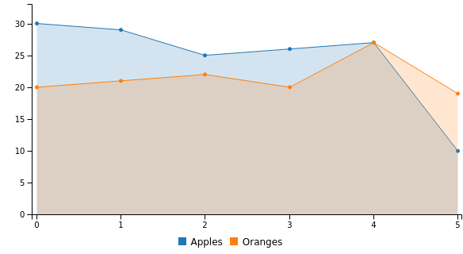
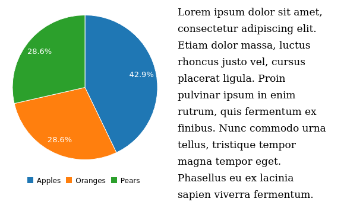

# Components
## Charts

### bar chart ( [Source](examples/bar_chart) )

### horizontal bar chart ( [Source](examples/horizontal_bar_chart) )

### donut chart ( [Source](examples/donut_chart) )

### pie chart ( [Source](examples/pie_chart) )

### stacked bar chart ( [Source](examples/stacked_bar_chart) )

### horizontal stacked bar chart ( [Source](examples/horizontal_stacked_bar_chart) )

### stacked line chart ( [Source](examples/stacked_line_chart) )

### stacked spline chart ( [Source](examples/stacked_spline_chart) )

### stacked area chart ( [Source](examples/stacked_area_chart) )

### gauge chart ( [Source](examples/gauge_chart) )

### scatter plot ( [Source](examples/scatter_plot) )

### line chart ( [Source](examples/line_chart) )

### bubble chart ( [Source](examples/bubble_chart) )

### spline chart ( [Source](examples/spline_chart) )

### custom axes ( [Source](examples/custom_axes) )

### area chart ( [Source](examples/area_chart) )

### step chart ( [Source](examples/step_chart) )

## Controls

### dropdown ( [Source](examples/dropdown) )

## Grid

### columns ( [Source](examples/columns) )

### rows ( [Source](examples/rows) )

## Text

### h1 text ( [Source](examples/h1_text) )

### h2 text ( [Source](examples/h2_text) )

### h3 text ( [Source](examples/h3_text) )

### p text ( [Source](examples/p_text) )

