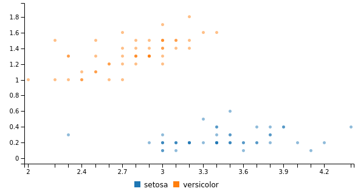

# Components
## Charts

### bar chart ( [Source](examples/bar_chart.yml) )

### donut chart ( [Source](examples/donut_chart.yml) )

### pie chart ( [Source](examples/pie_chart.yml) )

### gauge chart ( [Source](examples/gauge_chart.yml) )

### scatter chart ( [Source](examples/scatter_chart.yml) )

### line chart ( [Source](examples/line_chart.yml) )

### bubble chart ( [Source](examples/bubble_chart.yml) )

### spline chart ( [Source](examples/spline_chart.yml) )

### area chart ( [Source](examples/area_chart.yml) )

### step chart ( [Source](examples/step_chart.yml) )

## Controls

### dropdown ( [Source](examples/dropdown.yml) )

## Grid

### rows ( [Source](examples/rows.yml) )

### columns ( [Source](examples/columns.yml) )

## Text

### h1 text ( [Source](examples/h1_text.yml) )

### h2 text ( [Source](examples/h2_text.yml) )

### h3 text ( [Source](examples/h3_text.yml) )

### p text ( [Source](examples/p_text.yml) )

