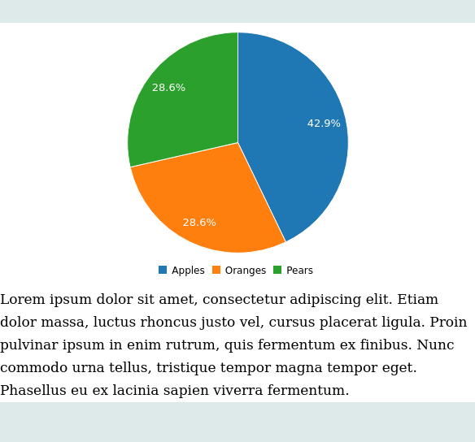

# How to use board
Here's an example code regarding the use of board: 

```yaml
dashboard "Example": 
  - 
    board: 
      - 
        rows: 
          - 
            pie chart: 
              columns: 
                - 
                  - "Apples"
                  - 3
                - 
                  - "Oranges"
                  - 2
                - 
                  - "Pears"
                  - 2
          - 
            p text: "Lorem ipsum dolor sit amet, consectetur adipiscing elit. Etiam dolor massa, luctus rhoncus justo vel, cursus placerat ligula. Proin pulvinar ipsum in enim rutrum, quis fermentum ex finibus. Nunc commodo urna tellus, tristique tempor magna tempor eget. Phasellus eu ex lacinia sapien viverra fermentum."

```
The code above will render a board that looks like this:


