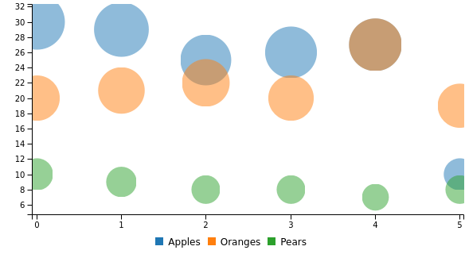

# How to use bubble chart
Here's an example code regarding the use of bubble chart: 

```yaml
---
  dashboard "Example": 
    - 
      bubble chart: 
        columns: 
          - 
            - "Apples"
            - 30
            - 29
            - 25
            - 26
            - 27
            - 10
          - 
            - "Oranges"
            - 20
            - 21
            - 22
            - 20
            - 27
            - 19
          - 
            - "Pears"
            - 10
            - 9
            - 8
            - 8
            - 7
            - 8

```
The code above will render a bubble chart that looks like this:


