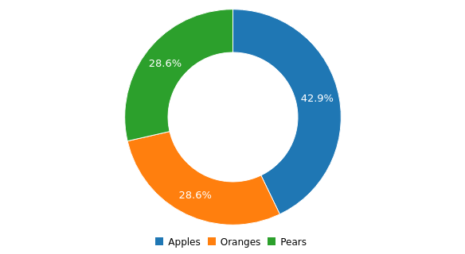

# How to use donut chart
Here's an example code regarding the use of donut chart: 

```yaml
dashboard "Example": 
  - 
    donut chart: 
      columns: 
        - 
          - "Apples"
          - 3
        - 
          - "Oranges"
          - 2
        - 
          - "Pears"
          - 2

```
The code above will render a donut chart that looks like this:



## JSON format
The YAML above is equivalent to this JSON:
```json
{
  "component": "root",
  "args": {
    "title": "Example"
  },
  "data": [
    {
      "component": "chart",
      "args": {
        "type": "donut",
        "stacked": false
      },
      "data": {
        "columns": [
          [
            "Apples",
            3
          ],
          [
            "Oranges",
            2
          ],
          [
            "Pears",
            2
          ]
        ]
      }
    }
  ]
}
```
