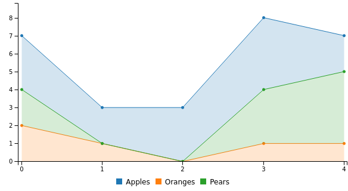

# How to use stacked area chart
Here's an example code regarding the use of stacked area chart: 

```yaml
---
  dashboard "Example": 
    - 
      stacked area chart: 
        columns: 
          - 
            - "Apples"
            - 3
            - 2
            - 3
            - 4
            - 2
          - 
            - "Oranges"
            - 2
            - 1
            - 0
            - 1
            - 1
          - 
            - "Pears"
            - 2
            - 0
            - 0
            - 3
            - 4

```
The code above will render a stacked area chart that looks like this:


