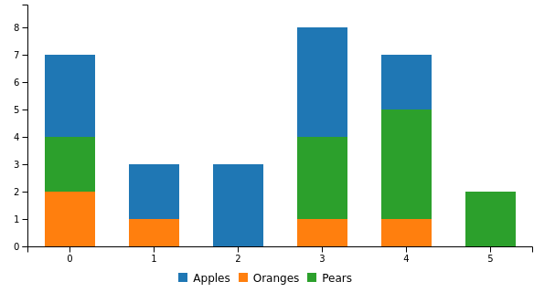

# How to use stacked bar chart
Here's an example code regarding the use of stacked bar chart: 

```yaml
dashboard "Example": 
  - 
    stacked bar chart: 
      columns: 
        - 
          - "Apples"
          - 3
          - 2
          - 3
          - 4
          - 2
        - 
          - "Oranges"
          - 2
          - 1
          - 0
          - 1
          - 1
        - 
          - "Pears"
          - 2
          - 0
          - 0
          - 3
          - 4

```
The code above will render a stacked bar chart that looks like this:


